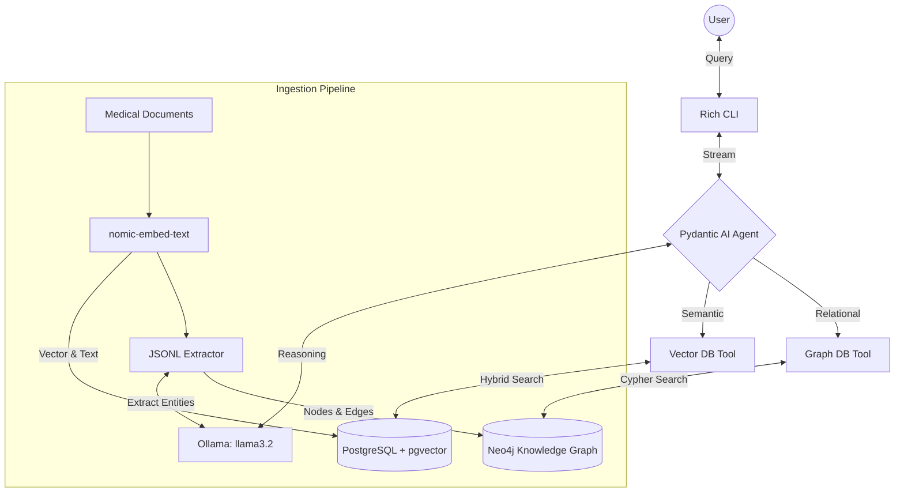

# Medical Edge-Native Agentic RAG

## Project Overview

This is an **Edge-Native, Privacy-First Agentic RAG** system designed for medical institutions as part of a B.Tech Project. 
The core innovation of this project focuses on **Zero Data Exfiltration** by keeping all processing local (no patient data leaves the hospital's network).

### Key Features
1. **100% Local Processing**: Utilizes Ollama (`llama3.2`) for local Large Language Model generation and local embeddings (`nomic-embed-text`), completely removing reliance on external cloud APIs like OpenAI.
2. **Temporal Knowledge Graphs**: Uses Graphiti + Neo4j to store patient timelines, treatment histories, and relationships, enabling complex medical queries that standard vector search struggles with.
3. **Hybrid Search (Vector + Graph)**:
   - *Semantic Search* (PostgreSQL + pgvector): Finds similar medical reports and clinical guidelines.
   - *Relational Search* (Neo4j): Finds complex timeline relationships (e.g., "Show me the timeline of medications this patient took").
4. **Multi-Persona Agentic RAG**: Dual agents tailored for **Clinical Staff** (Doctors/Nurses) and **Administrative Staff** (Insurance/Billing).

---

## Architecture Components
- **Language Model Framework**: Pydantic AI
- **LLM Engine**: Ollama (Running locally)
- **Primary Generator Model**: `llama3.2`
- **Embedding Model**: `nomic-embed-text`
- **Knowledge Graph**: Neo4j
- **Vector Database**: PostgreSQL with `pgvector`

### Architecture Diagram



---

## Implementation Journey

Below is the step-by-step methodology used to build the application.

### Step 1: Core Infrastructure
The foundational databases for the Agentic RAG system were containerized using Docker, leveraging PostgreSQL (with pgvector) and Neo4j. LLM generation was fully offloaded to local edge compute using Ollama.

### Step 2: Project Foundations
The core software components were installed and initialized. The system relies heavily on `pydantic-ai` for creating Type-Safe agents, and `asyncpg` combined with the official `neo4j` Python driver for fast, asynchronous database queries.

### Step 3: Data Processing & Ingestion
The goal of this step is to chunk mock medical documents (Patient Reports, Hospital Policies) and push them into both the Semantic Vector Database (PostgreSQL) and the Relational Knowledge Graph (Neo4j). 

**Overcoming Small Language Model Limitations:**
Standard graph extraction libraries (like `Graphiti`) prompt LLMs to generate massive, deeply-nested JSON schemas containing arrays of nodes and edges. While models like `gpt-4o` handle this easily, local 3B parameter models like `llama3.2` struggle severely, dropping brackets or hallucinating structures which causes the pipeline to crash in infinite parsing retries. 

To overcome this, **we implemented a Custom Deterministic SLM Extractor**:
1. **Semantic Text Chunking**: We use a custom local embedder `nomic-embed-text` with a 768 dimension size to intelligently chunk text.
2. **Deterministic Database Saving**: We save the chunks (and their vector embeddings) instantly to PostgreSQL.
3. **JSONL Graph Extraction**: We prompt the local `llama3.2` model to act as a pure strict entity extractor, forcing it to output a flat, line-delimited `JSONL` stream. This allows the local SLM to focus on one concept at a time.
   - We extract `CONDITIONS`, `MEDICATIONS`, `PERSONNEL`, and `FACILITIES`.
   - If the SLM hallucinates on Line 5, we simply catch the `JSONDecodeError` on that specific line, drop it, and continue parsing the other valid entities without failing the entire batch!
4. **Native Neo4j Population**: We wrote a custom async Python Native Neo4j wrapper that takes the Python Dicts returned by the JSONL parser and fires highly-optimized Cypher `MERGE` queries to construct the Knowledge Graph safely and reliably.

### Step 4: Medical Agent Development
Using **Pydantic AI**, we developed a medical orchestrator agent capable of autonomously deciding when to search via Vector semantics or Graph relationships. This agent uses `Ollama` running completely locally on edge hardware.
- `search_vector_db`: Triggers a fast `pgvector` hybrid search on PostgreSQL.
- `search_graph_db`: Triggers an optimized Cypher query on Native Neo4j to find relationship paths for specific Persons or Conditions.

### Step 5: Command Line Interface
The final step wrapped the intelligent assistant in a beautiful **Rich CLI Terminal Interface** for intuitive local interaction!

---

## Setup & Installation

Follow these instructions to run the Edge-Native Medical RAG system locally.

**1. Prerequisites**
- Install **Docker Desktop** and ensure the engine is actively running.
- Install **Ollama** locally on your machine.
- Install **Anaconda or Miniconda** for environment management.

**2. Start the Databases**
Run the `docker-compose.yml` to spin up PostgreSQL (with pgvector) and Neo4j.
```bash
docker-compose up -d
```

**3. Download Local AI Models**
Pull the necessary lightweight LLMs using Ollama:
```bash
ollama pull llama3.2
ollama pull nomic-embed-text
```

**4. Setup Python Environment**
Create an isolated Conda environment and install dependencies:
```bash
conda create -n btp python=3.11
conda activate btp
pip install -r requirements.txt
```

**5. Run Data Ingestion**
To populate the Graph and Vector databases with the medical context:
```bash
python -m ingestion.ingest --documents documents --clean
```

**6. Start the Agentic Chat Interface**
To interact with the local Medical RAG Agent:
```bash
python cli_chat.py
```

---

*Project Implementation Complete.*
