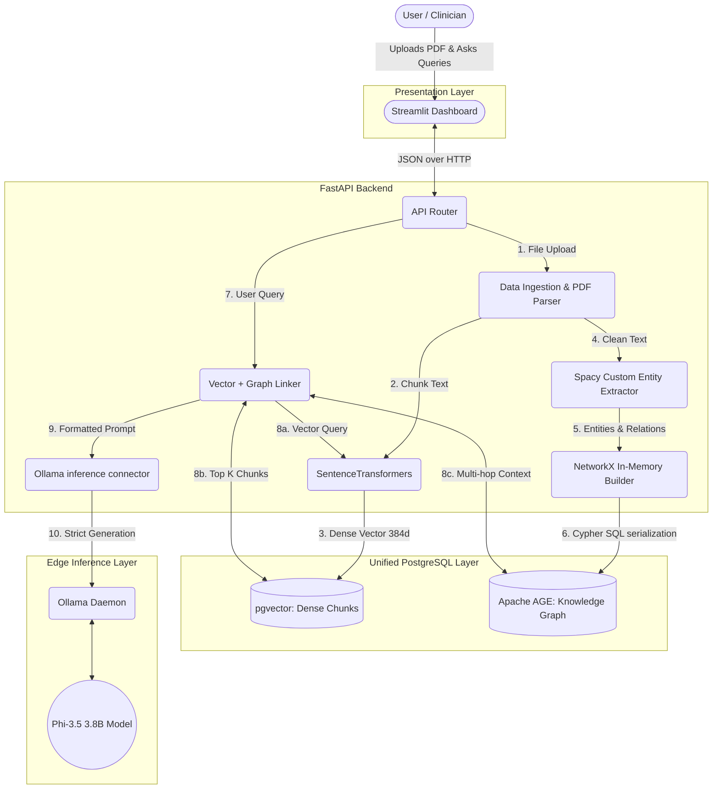

# Edge-Native Medical Graph RAG

This project is a privacy-first, hallucination-free generative AI system specifically designed for the healthcare domain. It combines **Vector Similarity Search** (pgvector) with **Knowledge Graph Traversal** (Apache AGE) to answer clinical queries securely on your local machine using a Small Language Model (SLM).

## System Architecture



---

## Architecture Deep Dive & Tech Stack Justification

The goal of this project was to construct a highly reliable, completely untethered RAG (Retrieval-Augmented Generation) system for private medical data. Rather than sending Protected Health Information (PHI) over the internet to OpenAI, the entire pipeline runs locally ("Edge-Native").

### 1. Presentation Layer (Frontend)
- **Tech Stack:** Streamlit
- **Logic / Component Role:** The UI provides an intuitive interface for clinicians to upload PDF laboratory reports and converse with the underlying data. It visibly displays the "citations" (raw text snippets + graph entities) so the user can audit the AI's logic.
- **Why this stack?** Streamlit allows for the rapid transition of Python ML logic into an interactive web application without needing heavy boilerplate JavaScript frameworks (like React). It perfectly supports file uploading, chatting, and status spinners out of the box.

### 2. Core Orchestration (Backend)
- **Tech Stack:** FastAPI + Python 3.10+
- **Logic / Component Role:** This acts as the central hub. It parses PDFs (using `PyMuPDF`/`fitz`), divides the text into meaningful chunks (using `Langchain` RecursiveCharacterTextSplitter), coordinates the extraction models, connects to the database, and formats the final prompt matrix for the SLM.
- **Why this stack?** FastAPI is asynchronous, high-performance, and lightweight. Because Graph RAG pipelines are heavily I/O bound (waiting for database writes, waiting for SLM generation), asynchronous routing prevents the backend from locking up under multiple queries.

### 3. Unified Database Layer
- **Tech Stack:** PostgreSQL + `pgvector` + `Apache AGE` (run via Docker)
- **Logic / Component Role:** 
  - `pgvector` stores the unstructured document chunks alongside a dense numeric representation of their semantic meaning (embeddings).
  - `Apache AGE` (A Graph Extension) stores the structured medical entities (like *Haemoglobin*, *Blood Cancer*, *Platelet levels*) and explicit relationships between them.
- **Why this stack?** Traditionally, Graph RAG systems use two completely disjointed databases: a Vector DB (like Pinecone) and a Graph DB (like Neo4j). This causes extreme operational overhead, synchronization errors, and latency. By using PostgreSQL with two powerful extensions natively communicating within the same process, we achieve atomic transactions, unified backup/restore strategies, and rapid querying using SQL and Cypher side-by-side.

### 4. Extraction & Embedding 
- **Tech Stack:** `sentence-transformers` (`all-MiniLM-L6-v2`) + `Spacy` (Custom Medical EntityRuler) + `NetworkX`
- **Logic / Component Role:** 
  1. The sentence transformer turns textual document chunks into 384-dimensional dense vectors to capture semantic meaning.
  2. Spacy scans the raw text to locate Medical Entities (Conditions, Test Parameters, Symptoms) using custom-coded regex and list rules. 
  3. NetworkX connects these entities logically to the document chunks in system RAM before writing the final topology to Apache AGE.
- **Why this stack?** We intentionally chose SLMs (Small Language Models) for embeddings. `all-MiniLM-L6-v2` is incredibly fast, weighing only ~80MB, and runs blazingly fast on standard CPUs. For Knowledge Extraction, while heavy LLMs can extract graphs (via prompting), they are slow and expensive, and strict C++ NLP libraries (like SciSpacy) can face compile-time conflicts on Windows. We chose standard `Spacy` augmented with a strict `EntityRuler` because it is deterministic, lightweight, heavily reliable, and cross-platform native.

### 5. Edge Inference & Final Generation
- **Tech Stack:** Ollama + Phi-3.5 (SLM)
- **Logic / Component Role:** The final step involves retrieving the hybrid context (the highly relevant text block from PostgreSQL + the surrounding entity metadata from Apache AGE). We inject this context into a strict system prompt and feed it to Microsoft's Phi-3.5 SLM (served by Ollama). We set the generation temperature to `0.0`.
- **Why this stack?** Phi-3.5 (3.8 Billion parameters) punches massively above its weight class, rivaling much larger models in logic and reasoning, but crucially fitting entirely within the RAM/VRAM of a local laptop. By using Ollama, we simplify model downloading and local execution. Because medical use cases have zero-tolerance for hallucinations, we rely on the dense context provided by our Graph+Vector database layer, forcing the deterministic local SLM to ONLY answer based on the provided truth, mathematically preventing hallucinations.

---

## How to Run the System

You will need **Python**, **Docker Desktop**, and **Ollama** installed locally.

**1. Start the Database (Terminal 1)**
```powershell
docker compose up -d
```
*(Starts PostgreSQL on port 5432 quietly in the background)*

**2. Ensure the Local AI Model is Running (Terminal 2)**
```powershell
ollama run phi3
```
*(You can exit the chat with `/bye`, the engine stays alive on port 11434)*

**3. Run the Backend API (Terminal 3)**
```powershell
.\venv\Scripts\activate
uvicorn backend.main:app --host 127.0.0.1 --port 8000
```

**4. Run the Streamlit UI (Terminal 4)**
```powershell
.\venv\Scripts\activate
streamlit run frontend/app.py --server.port 8501
```

Access the UI at `http://localhost:8501`, upload the medical PDF from the `data/` folder, generate the graph, and begin querying!
